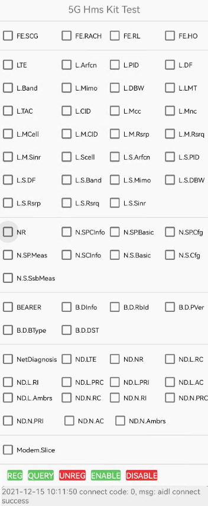

# 华为5G Modem Kit Sample

## 目录

 * [简介](#简介)
 * [开发准备](#开发准备)
 * [环境要求](#环境要求)
 * [运行结果](#运行结果)
 * [技术支持](#技术支持)
 * [授权许可](#授权许可)


## 简介

本示例代码封装5G Modem Kit SDK服务的安卓接口，通过该示例代码，您将体验到如何使用5G Modem Kit相关接口查询Modem参数信息。

## 开发准备

      1. 检查Android Studio开发环境是否准备就绪。
      2. 打开示例项目，在您的安卓设备上运行示例代码。

## 环境要求

1. 推荐Android SDK版本号为28或以上，JDK版本号为1.8或以上。
2. 该版本使用了Java 8的新特性：如Lambda 表达式等。Gradle需要添加Java 8编译配置如下：

```
    compileOptions {
        sourceCompatibility JavaVersion.VERSION_1_8
        targetCompatibility JavaVersion.VERSION_1_8
    }
```


## 运行结果

   

其中上图复选框部分为Modem参数的简称，详情请参见如下表格，其中**description**部分描述了该Modem参数请求信息。

| 简称      | modem参数                                                    | description                  |
| --------- | ------------------------------------------------------------ | ---------------------------- |
| LTE       | LTE = "LTE"                                                  | LTE所有信息                  |
| L.Arfcn   | LTE_ARFCN = "LTE.arfcn"                                      | LTE小区频点                  |
| L.PID     | LTE_PHYCELLID = "LTE.phyCellId"                              | LTE物理小区ID                |
| L.DF      | LTE_DLFREQ = "LTE.dlFreq"                                    | LTE下行物理频率              |
| L.Band    | LTE_BAND = "LTE.band"                                        | LTE频带指示                  |
| L.Mimo    | LTE_MIMO = "LTE.mimo"                                        | LTE小区的MIMO层数            |
| L.DBW     | LTE_DL_BANDWIDTH = "LTE.dlBandWidth"                         | LTE小区带宽                  |
| L.LMT     | LTE_LTE_MODE_TYPE = "LTE.lteModeType"                        | LTE小区模式类型              |
| L.TAC     | LTE_TRACK_AREA_CODE = "LTE.trackAreaCode"                    | TAC信息                      |
| L.CID     | LTE_CELL_IDENTITY = "LTE.cellIdentity"                       | 全球小区ID                   |
| L.Mcc     | LTE_MCC = "LTE.mcc"                                          | 移动国家码MCC                |
| L.Mnc     | LTE_MNC = "LTE.mnc"                                          | 移动网络码MNC                |
| L.MCell   | LTE_INTRA_EUTRA_CELL_MEAS_INFO = "LTE.measCell"              | LTE主小区测量结果全部信息    |
| L.M.CID   | LTE_INTRA_EUTRA_CELL_MEAS_INFO_CELLID = "LTE.measCell_cellId" | LTE主小区物理小区ID          |
| L.M.Rsrp  | LTE_INTRA_EUTRA_CELL_MEAS_INFO_RSRP = "LTE.measCell_rsrp"    | LTE主小区RSRP测量值          |
| L.M.Rsrq  | LTE_INTRA_EUTRA_CELL_MEAS_INFO_RSRQ = "LTE.measCell_rsrq"    | LTE主小区RSRQ测量值          |
| L.M.Sinr  | LTE_INTRA_EUTRA_CELL_MEAS_INFO_SINR = "LTE.measCell_sinr"    | LTE主小区SINR测量值          |
| L.Scell   | LTE_SCELL = "LTE.scell"                                      | LTE辅小区信息全部信息        |
| L.S.Arfcn | LTE_SCELL_arfcn = "LTE.scell_arfcn"                          | LTE辅小区频点                |
| L.S.PID   | LTE_SCELL_phyCellId = "LTE.scell_phyCellId"                  | LTE辅小区物理小区ID          |
| L.S.DF    | LTE_SCELL_dlFreq = "LTE.scell_dlFreq"                        | LTE辅小区下行物理频率        |
| L.S.Band  | LTE_SCELL_band = "LTE.scell_band"                            | LTE辅小区频带指示            |
| L.S.Mimo  | LTE_SCELL_mimo = "LTE.scell_mimo"                            | LTE辅小区mimo层数            |
| L.S.DBW   | LTE_SCELL_dlBandWidth = "LTE.scell_dlBandWidth"              | LTE辅小区带宽                |
| L.S.Rsrp  | LTE_SCELL_rsrp = "LTE.scell_rsrp"                            | LTE辅小区RSRP测量值          |
| L.S.Rsrq  | LTE_SCELL_rsrq = "LTE.scell_rsrq"                            | LTE辅小区RSRQ测量值          |
| L.S.Sinr  | LTE_SCELL_sinr = "LTE.scell_sinr"                            | LTE辅小区SINR测量值          |
| NR        | NR = "NR"                                                    | 所有NR信息                   |
| N.SCInfo  | NR_SERV_CELL_INFO = "NR.servCellInfo"                        | 所有NR服务小区信息           |
| N.S.Arfcn | NR_SSB_ARFCN = "NR.servCellInfo_ssbArfcn"                    | NR小区下行SSB频点            |
| N.S.PCI   | NR_PHY_CELL_ID = "NR.servCellInfo_phyCellId"                 | NR小区物理小区ID             |
| N.S.Band  | NR_BAND = "NR.servCellInfo_band"                             | NR小区频带指示               |
| N.S.CGT   | NR_CGTYPE = "NR.servCellInfo_cgType"                         | NR小区所属的CELL GROUP类型   |
| N.S.CT    | NR_CELL_TYPE = "NR.servCellInfo_cellType"                    | NR小区类型                   |
| N.S.ST    | NR_SCS_TYPE = "NR.servCellInfo_scsType"                      | NR小区子载波间隔             |
| N.S.DML   | NR_DLMIMO_LAYERS = "NR.servCellInfo_dlMimoLayers"            | 空口配置的下行MIMO层数       |
| N.S.DT    | NR_DSS_TYPE = "NR.servCellInfo_dssType"                      | DSS类型                      |
| N.S.SRp   | NR_SSB_RSRP = "NR.servCellInfo_ssbRsrp"                      | NR服务小区SSB RSRP测量结果   |
| N.S.SRq   | NR_SSB_RSRQ = "NR.servCellInfo_ssbRsrq"                      | NR服务小区SSB RSRQ测量结果   |
| N.S.SSr   | NR_SSB_SINR = "NR.servCellInfo_ssbSinr"                      | NR服务小区SSB SINR测量结果   |
| N.S.CRp   | NR_CSI_RSRP = "NR.servCellInfo_csiRsrp"                      | NR服务小区CSIRS RSRP测量结果 |
| N.S.CRq   | NR_CSI_RSRQ = "NR.servCellInfo_csiRsrq"                      | NR服务小区CSIRS RSRQ测量结果 |
| N.S.CSr   | NR_CSI_SINR = "NR.servCellInfo_csiSinr"                      | NR服务小区CSIRS SINR测量结果 |
| BEARER    | BEARER = "BEARER"                                            | 所有BEARER信息               |
| B.DInfo   | BEARER_DRB_INFO = "BEARER.drbInfo"                           | 所有drb信息                  |
| B.D.RbId  | BEARER_RBID = "BEARER.drbInfo_rbId"                          | DRB ID                       |
| B.D.PVer  | BEARER_PDCP_VERSION = "BEARER.drbInfo_pdcpVersion"           | PDCP Version                 |
| B.D.BType | BEARER_BEARER_TYPE = "BEARER.drbInfo_bearerType"             | bearer类型                   |
| B.D.DST   | BEARER_DATA_SPLIT_THRESHOLD =  "BEARER.drbInfo_dataSplitThreshold" | UE上行数据分裂阈值           |

##  技术支持

如果您对HMS Core还处于评估阶段，可在[Reddit社区](https://www.reddit.com/r/HuaweiDevelopers/)获取关于HMS Core的最新讯息，并与其他开发者交流见解。

如果您对使用HMS示例代码有疑问，请尝试：

- 开发过程遇到问题上[Stack Overflow](https://stackoverflow.com/questions/tagged/huawei-mobile-services)，在\[huawei-mobile-services]标签下提问，有华为研发专家在线一对一解决您的问题。
- 到[华为开发者论坛](https://developer.huawei.com/consumer/cn/forum/blockdisplay?fid=18) HMS Core板块与其他开发者进行交流。

如果您在尝试示例代码中遇到问题，请向仓库提交[issue]()，也欢迎您提交[Pull Request]()。

##  授权许可

5G Kit示例代码经过[Apache License, version 2.0](http://www.apache.org/licenses/LICENSE-2.0)授权许可。