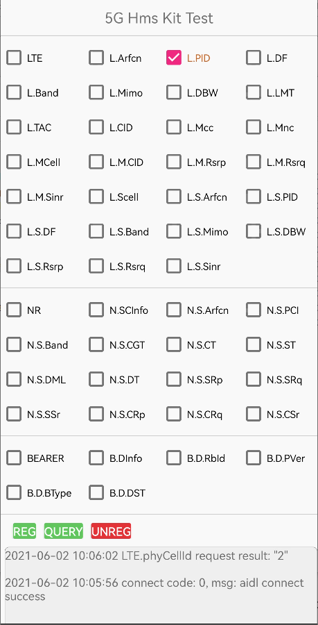

# Huawei 5G Modem Kit Demo

English | [中文](README_ZH.md)

## Table of Contents

* [Introduction](#introduction)
* [Getting Started](#getting-started)
* [Supported Environments](#supported-environments)
* [Result](#result)
* [Technical Support](#technical-support)
* [License](#license)

## Introduction

The sample code encapsulates the Android API of the 5G Modem SDK and demonstrates how to use the 5G Modem Kit API to query modem parameters.

## Getting Started

  1. Install Android Studio on your computer.
  2. Open and run the sample project on your Android device.

## Supported Environments

1. Android SDK 26 or later and JDK 1.8 or later are recommended.
2. As the current version uses Java 8 language features, such as lambda expressions, configure compilation options for Gradle as follows:

```
    compileOptions {
        sourceCompatibility JavaVersion.VERSION_1_8
        targetCompatibility JavaVersion.VERSION_1_8
    }
```

## Result

  

The following table details the modem parameters. The **Description** column describes the requested data of the corresponding modem parameter.

| Abbreviation | Modem Parameter                                              | Description                                                 |
| ---------    | ------------------------------------------------------------ | ----------------------------------------------------------- |
| LTE          | LTE = "LTE"                                                  | All Long-Term Evolution (LTE) information                   |
| L.Arfcn      | LTE_ARFCN = "LTE.arfcn"                                      | LTE cell frequency                                          |
| L.PID        | LTE_PHYCELLID = "LTE.phyCellId"                              | LTE physical cell ID (PCI)                                  |
| L.DF         | LTE_DLFREQ = "LTE.dlFreq"                                    | LTE downlink E-UTRA Absolute Radio Frequency Channel Number (EARFCN) |
| L.Band       | LTE_BAND = "LTE.band"                                        | LTE frequency band indicator                                |
| L.Mimo       | LTE_MIMO = "LTE.mimo"                                        | Number of multiple-input multiple-output (MIMO) layers in an LTE cell |
| L.DBW        | LTE_DL_BANDWIDTH = "LTE.dlBandWidth"                         | LTE cell bandwidth                                          |
| L.LMT        | LTE_LTE_MODE_TYPE = "LTE.lteModeType"                        | LTE cell mode                                               |
| L.TAC        | LTE_TRACK_AREA_CODE = "LTE.trackAreaCode"                    | Tracking area code (TAC) information                        |
| L.CID        | LTE_CELL_IDENTITY = "LTE.cellIdentity"                       | Global cell ID (GCI)                                        |
| L.Mcc        | LTE_MCC = "LTE.mcc"                                          | Mobile country code (MCC)                                   |
| L.Mnc        | LTE_MNC = "LTE.mnc"                                          | Mobile network code (MNC)                                   |
| L.MCell      | LTE_INTRA_EUTRA_CELL_MEAS_INFO = "LTE.measCell"              | All LTE primary cell (PCell) measurements                   |
| L.M.CID      | LTE_INTRA_EUTRA_CELL_MEAS_INFO_CELLID = "LTE.measCell_cellId" | PCI of the LTE PCell                                        |
| L.M.Rsrp     | LTE_INTRA_EUTRA_CELL_MEAS_INFO_RSRP = "LTE.measCell_rsrp"    | Reference signal received power (RSRP) value of the LTE PCell 
| L.M.Rsrq     | LTE_INTRA_EUTRA_CELL_MEAS_INFO_RSRQ = "LTE.measCell_rsrq"    | Reference signal received quality (RSRQ) value of the LTE PCell |
| L.M.Sinr     | LTE_INTRA_EUTRA_CELL_MEAS_INFO_SINR = "LTE.measCell_sinr"    | Signal-to-interference-plus-noise ratio (SINR) value of the LTE PCell |
| L.Scell      | LTE_SCELL = "LTE.scell"                                      | All LTE secondary cell (SCell) measurements                 |
| L.S.Arfcn    | LTE_SCELL_arfcn = "LTE.scell_arfcn"                          | LTE SCell frequencies                                       |
| L.S.PID      | LTE_SCELL_phyCellId = "LTE.scell_phyCellId"                  | PCIs of LTE SCells                                          |
| L.S.DF       | LTE_SCELL_dlFreq = "LTE.scell_dlFreq"                        | LTE SCell downlink EARFCNs                                  |
| L.S.Band     | LTE_SCELL_band = "LTE.scell_band"                            | LTE SCell frequency band indicators                         |
| L.S.Mimo     | LTE_SCELL_mimo = "LTE.scell_mimo"                            | Numbers of MIMO layers of LTE SCells                        |
| L.S.DBW      | LTE_SCELL_dlBandWidth = "LTE.scell_dlBandWidth"              | LTE SCell bandwidths                                        |
| L.S.Rsrp     | LTE_SCELL_rsrp = "LTE.scell_rsrp"                            | RSRP values of LTE SCells                                   |
| L.S.Rsrq     | LTE_SCELL_rsrq = "LTE.scell_rsrq"                            | RSRQ values of LTE SCells                                   |
| L.S.Sinr     | LTE_SCELL_sinr = "LTE.scell_sinr"                            | SINR values of LTE SCells                                   |
| NR           | NR = "NR"                                                    | All New Radio (NR) information                              |
| N.SPCInfo    | NR_SPCELL_INFO = "NR.spCellInfo"                             | Spcell information                                          |
| N.SP.Basic   | NR_SPCELL_BASIC = "NR.spCellInfo_basicInfo"                  | Basic information about the Spcell                          |
| N.SP.Cfg     | NR_SPCELL_CFG = "NR.spCellInfo_cfgInfo"                      | Configuration information about the Spcell                  |
| N.SP.Meas    | NR_SPCELL_MEAS = "NR.spCellInfo_measInfo "                   | measurements information about the Spcell                   |
| N.SCInfo     | NR_SCELL_INFO = "NR.sCellInfo"                               | NR SCell information                                        |
| N.S.Basic    | NR_SCELL_BASIC = "NR.sCellInfo_basicInfo"                    | NR SCell Basic information                                  |
| N.S.Cfg      | NR_SCELL_CFG = "NR.sCellInfo_cfgInfo"                        | NR SCell configuration                                      |
| N.S.SsbMeas  | NR_SCELL_SSB_MEAS = "NR. sCellInfo_ssbMeasInfo "             | NR SCell measurements                                       |
| NetDiagnosis | NET = "NETDIAGNOSIS"                                         | Network diagnosis information                               |
| ND.LTE       | NET_LTE_INFO = "NETDIAGNOSIS.lteInfo"                        | LTE network diagnosis information                           |
| ND.NR        | NET_NR_INFO = "NETDIAGNOSIS.nrInfo"                          | NR network diagnosis information                            |
| ND.L.RC      | NET_LTE_REJ_CNT = "NETDIAGNOSIS.lteInfo_rejCnt"              | Number of rejected LTE registration requests                |
| ND.L.RI      | NET_LTE_REJ_INFOS = "NETDIAGNOSIS.lteInfo_rejInfos"          | Detailed information about LTE registration rejection       |
| ND.L.PRC     | NET_LTE_PDN_REJ_CNT = "NETDIAGNOSIS.lteInfo_pdnRejCnt"       | Number of rejected LTE packet data network (PDN) connectivity requests |
| ND.L.PRI     | NET_LTE_PDN_REJ_INFOS = "NETDIAGNOSIS.lteInfo_pdnRejInfos"   | LTE PDN connectivity rejection information                  |
| ND.L.AC      | NET_LTE_AMBR_CNT = "NETDIAGNOSIS.lteInfo_ambrCnt"            | Number of aggregate maximum bit rates (AMBRs) of the LTE packet data unit (PDU) bearers |
| ND.L.Ambrs   | NET_LTE_AMBRS = "NETDIAGNOSIS.lteInfo_ambrs"                 | AMBR information corresponding to the default bearer        |
| ND.N.RC      | NET_NR_REJ_CNT = "NETDIAGNOSIS.nrInfo_rejCnt"                | Number of rejected NR registration requests                 |
| ND.N.RI      | NET_NR_REJ_INFO = "NETDIAGNOSIS.nrInfo_rejInfos"             | Detailed information about NR registration rejection        |
| ND.N.PRC     | NET_NR_PDU_REJ_CNT = "NETDIAGNOSIS.nrInfo_pduRejCnt"         | Number of PDU session establishment rejections              |
| ND.N.PRI     | NET_NR_PDU_REJ_INFO = "NETDIAGNOSIS. nrInfo_pduRejInfo"      | PDU session establishment rejection information             |
| ND.N.AC      | NET_NR_AMBR_CNT = "NETDIAGNOSIS.nrInfo_ambrCnt"              | Number of PDU Session-AMBR messages                         |
| ND.N.Ambrs   | NET_NR_AMBR = "NETDIAGNOSIS. nrInfo_ambr"                    | NR Session-AMBR information                                 |
| FE.SCG       | NET_NR_PDU_REJ_CNT = "NETDIAGNOSIS.nrInfo_pduRejCnt"         | Enable for proactively reporting SCG failures               |
| FE.RACH      | NET_NR_PDU_REJ_INFO = "NETDIAGNOSIS. nrInfo_pduRejInfo"      | Enable for proactively reporting RACH failures              |
| FE.RL        | NET_NR_AMBR_CNT = "NETDIAGNOSIS.nrInfo_ambrCnt"              | Enable for proactively reporting radio link failures        |
| FE.HO        | NET_NR_AMBR = "NETDIAGNOSIS. nrInfo_ambr"                    | Enable for proactively reporting handover failures          |
| Modem.Slice  | NET_NR_AMBR = "NETDIAGNOSIS. nrInfo_ambr"                    | Modem system timestamp                                      |
| BEARER       | BEARER = "BEARER"                                            | All bearer information                                      |
| B.DInfo      | BEARER_DRB_INFO = "BEARER.drbInfo"                           | All data radio bearer (DRB) information                     |
| B.D.RbId     | BEARER_RBID = "BEARER.drbInfo_rbId"                          | DRB IDs                                                     |
| B.D.PVer     | BEARER_PDCP_VERSION = "BEARER.drbInfo_pdcpVersion"           | Packet Data Convergence Protocol (PDCP) versions            |
| B.D.BType    | BEARER_BEARER_TYPE = "BEARER.drbInfo_bearerType"             | Bearer types                                                |
| B.D.DST      | BEARER_DATA_SPLIT_THRESHOLD =  "BEARER.drbInfo_dataSplitThreshold" | Uplink data split threshold for user equipment (UE)       |

## Technical Support

If you want to evaluate more about HMS Core, [r/HMSCore on Reddit](https://www.reddit.com/r/HuaweiDevelopers/) is for you to keep up with latest news about HMS Core, and to exchange insights with other developers.

If you have any questions about how to use HMS samples, try the following options:

- [Stack Overflow](https://stackoverflow.com/questions/tagged/huawei-mobile-services?tab=Votes) is the best place for any programming questions. Be sure to tag your question with \[huawei-mobile-services].
- [The HMS Core module of HUAWEI Developer Forum](https://forums.developer.huawei.com/forumPortal/en/forum/hms-core?ha_source=hms1) is great for general questions, or seeking recommendations and opinions.

If you run into a bug in our samples, please submit an [issue]() to the Repository. Even better you can submit a [Pull Request]() with a fix.

## License

The 5G Modem Kit demo is licensed under the [Apache License, version 2.0](http://www.apache.org/licenses/LICENSE-2.0).
